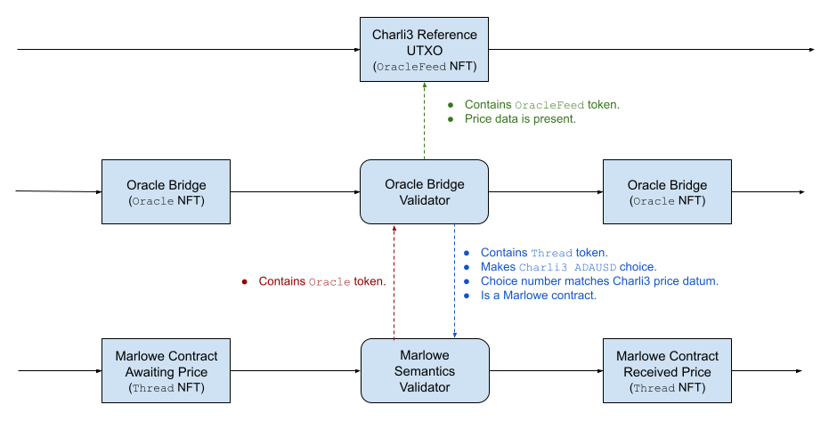

# Plutus bridge from Charli3 oracles to Marlowe contracts

The Charli3 oracle bridge is a Plutus V2 script that verifies that a Charli3 oracle's reference input datum is correctly embodied into an `IChoice` action for a Marlowe contract. ***This Plutus script is experimental and has not been optimized or audited.***

This "oracle bridge" is a small Plutus validator script that verifies that the price from the Charli3 oracle feed's reference UTXO is correctly input into the price Choice for the Marlowe contract. The oracle bridge enforces the following security guarantees:

1. The bridge will only read the price data from the oracle feed reference UTXO that contains the specified Charli3 `OracleFeed` token's policy ID.
2. The bridge ensures that the `ChoiceId` of the Marlowe contract `IChoice` action matches the specified name of the Charli3 oracle feed (for example, `Charli3 ADAUSD`).
3. The bridge checks that the `ChoiceNum` of the Marlowe contract `IChoice` action matches the prices datum in the oracle feed reference UTXO.
4. The bridge checks for the presence of the "thread" role token in the Marlowe contract instance.
5. The bridge holds the oracle-bridge role token for the Marlowe contract instance, ensuring that Marlowe will only accept oracle input from that particular bridge instance.
6. The contract uses the Marlowe validator.
7. The Cardano ledger and Charli3 semantics ensure that a "stale" or dated reference UTXO is not used by the bridge.

The bridge assumes that the Charli3 oracle spends the UTxOs when the value stops being current, so one need not concern about the time at which the value refers.

The diagram below shows the oracle bridge's interaction with the Charli3 reference UTXO and with the Marlowe contract. The Marlowe contract is not aware of the bridge's nature aside from the fact that the bridge holds (in this example) the `Oracle` role token that authorizes the `IChoice` that inputs the `Charli3 ADA/USD` price into the Marlowe contract.



The simplest possible Marlowe contract that interacts with an oracle is shown below. The contract simply waits for price input from the oracle bridge and then waits for a notification to close the contract. (Note that the price input and notification cannot take place in the same transaction because of Marlowe's guard against double-satisfaction attacks.) A more realistic Marlowe contract would use the price input in its payment logic.


## Parameters

The bridge validator takes three parameters:

1. The currency symbol for the token held in the Charli3 oracle's reference UTXO.
2. The token name for the token held in the Charli3 oracle's reference UTXO.
3. The name of the Marlowe `Choice` where the Marlowe contract will receive oracle input.


## Datum

The datum consist of a pair of items.

1. The public key hash for the operator of the oracle.
2. The token name for the thread role token held by the Marlowe contract.


## Redeemer

The redeemer is a boolean.

1. `True` if the oracle should verify the consistency of the Marlowe input with the Charli3 oracle and then continue operating.
2. `False` if the oracle should terminate.


## UTXO

The bridge's UTXO must contain the role token for the Marlowe party making the `Choice` action for the oracle. It may not contain other tokens, aside from ada.


## Transaction

The transactions where the bridge is used to ensure consistency between a Charli3 oracle feed and a Marlowe `Choice` must consist of the following:

1. The Charli3 reference input containing is oracle feed token and the price data.
2. The Marlowe UTXO and `IChoice` action for receiving the price.
3. The bridge UTXO where datum remains unchanged before/after the transaction, and with a redeemer of `True`.


## Creating the script and computing its hash.

Simply run the executable program with the three oracle parameters and output file name as arguments.

```bash
marlowe-charli3 30d7c4da385a1f5044261d27b6a22d46b645ca3567636df5edeb303d \
                "OracleFeed" \
                "Charli3 ADAUSD" \
                charli3-mainnet.plutus
```


## Example

See the example of running the oracle on `mainnet`, [charli3.ipynb](charli3.ipynb), which is best viewed [here](https://nbviewer.org/github/input-output-hk/marlowe-plutus/blob/main/marlowe-plutus/charli3.ipynb), or its [video demonstration](https://youtu.be/_9DgXb323CE). Note that the example is for a slightly outdated version of this Plutus script.


## Help

```console
$ marlowe-charli3 --help

marlowe-charli3 : run a Charli3 oracle bridge for Marlowe contracts

Usage: marlowe-charli3 CURRENCY_SYMBOL TOKEN_NAME CHOICE_NAME FILE_NAME

  This command-line tool outputs a Plutus script that bridges a Charli3 oracle
  to a Marlowe contract.

Available options:
  -h,--help                Show this help text
  CURRENCY_SYMBOL          The currency symbol for the Charli3 oracle reference
                           input token. For example,
                           "30d7c4da385a1f5044261d27b6a22d46b645ca3567636df5edeb303d"
                           on mainnet and
                           "e4c846f0f87a7b4524d8e7810ed957c6b7f6e4e2e2e42d75ffe7b373"
                           on preprod.
  TOKEN_NAME               The token name for the Charli3 oracle reference
                           input token. For example, "OracleFeed".
  CHOICE_NAME              The Marlowe choice name for the oracle input to the
                           contract. For example, "Charli3 ADAUSD".
  FILE_NAME                The name of the file for the Plutus script.
```
